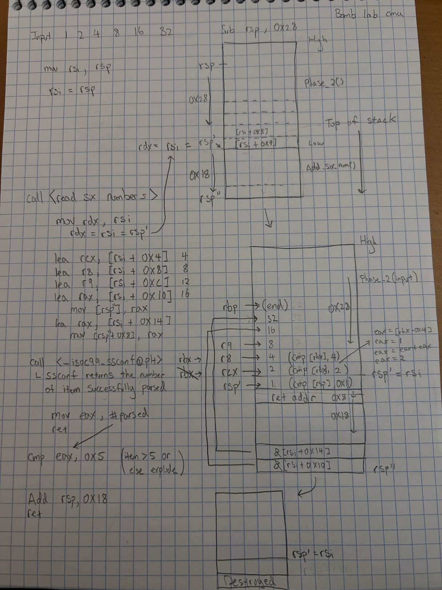
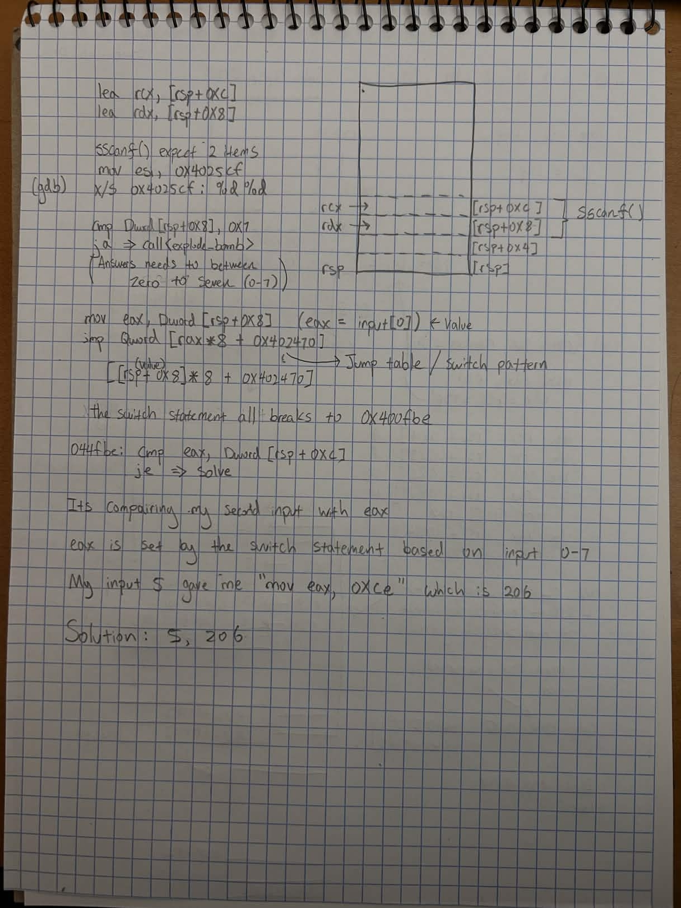
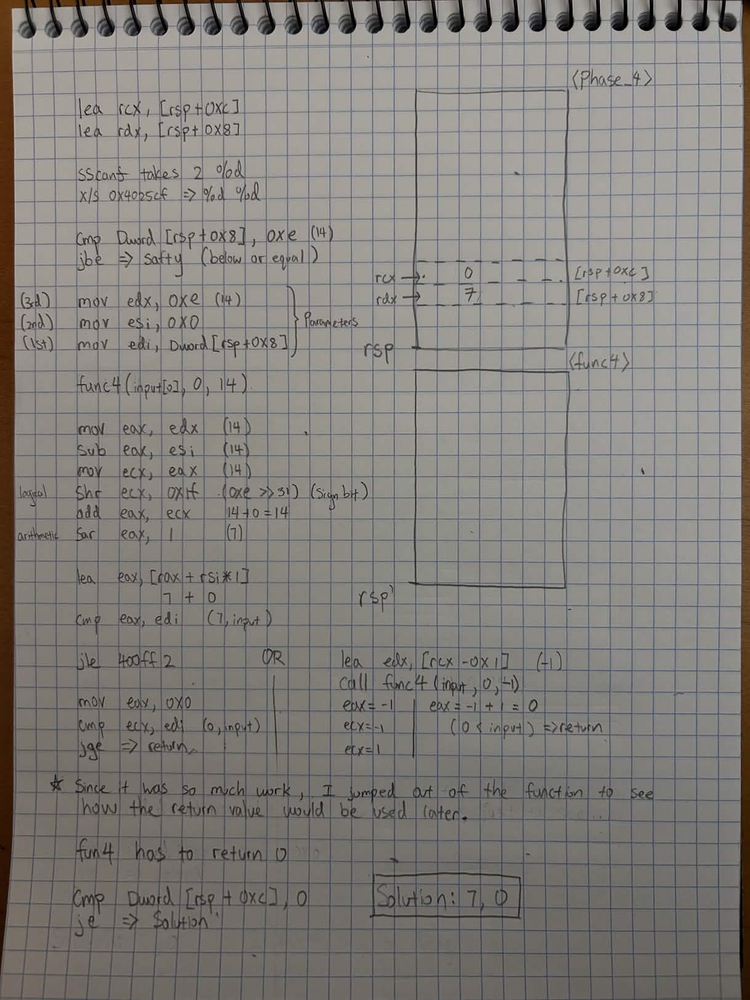
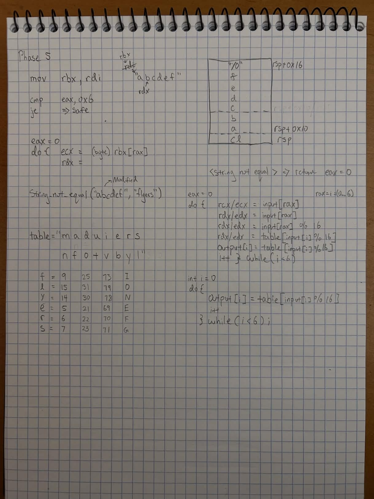
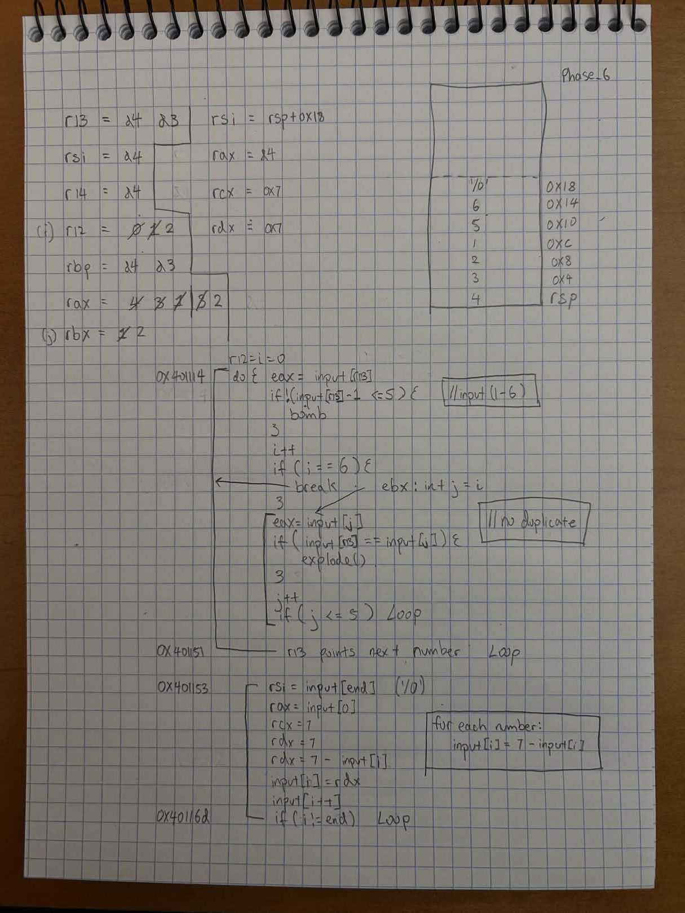
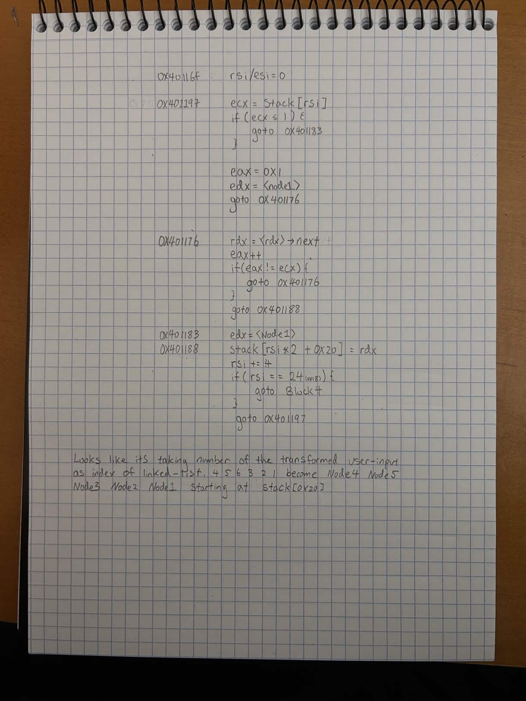
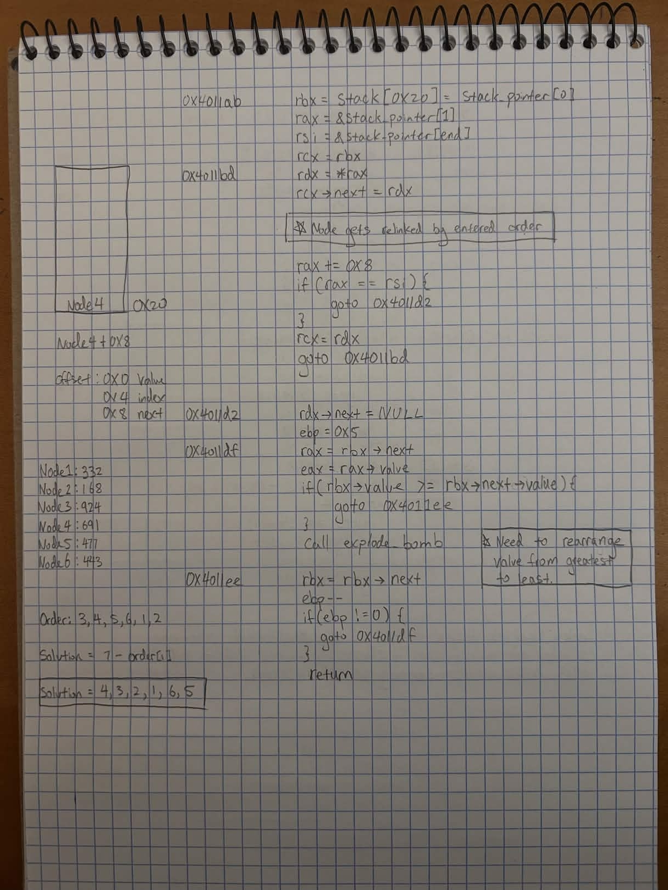
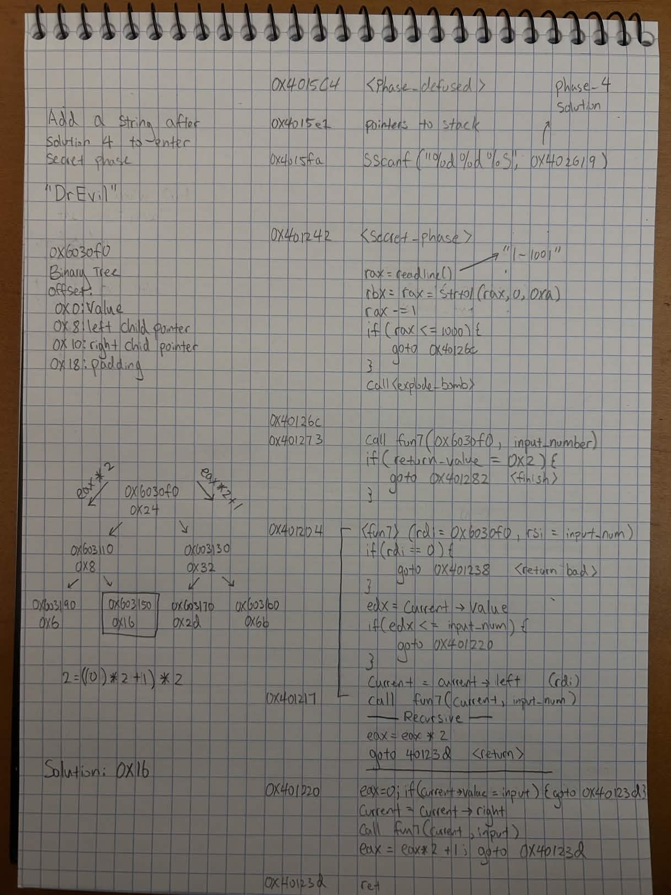

## Tools & Techniques
**GDB** — Dynamic analysis: breakpoints, stepping, 
memory examination (x/), register inspection. 
Used TUI mode (layout asm) for disassembly navigation.

**Objdump** — Static analysis: symbol table (-t) to map 
functions and data labels, disassembly (-d) to get 
full binary overview.

**Key concepts applied:**
- System V AMD64 calling convention (rdi, rsi, rdx, rcx, r8, r9)
- Stack frame layout: prologue/epilogue, callee-saved registers, 
  return addresses between frames
- Recognizing compiler patterns: switch/jump tables, 
  loop constructs, binary search, linked list traversal, 
  binary tree recursion
- sscanf return value checks for input validation
- Stack canaries (fs:0x28)
# Phase 1 - String Comparison
### Main Puzzle Logic
- Checks input with 0x402400
- 0x402400 holds "Border relations with Canada have never been better."
```
0000000000400ee0 <phase_1>:
  400ee0:       48 83 ec 08             sub    rsp,0x8
  400ee4:       be 00 24 40 00          mov    esi,0x402400
  400ee9:       e8 4a 04 00 00          call   401338 <strings_not_equal>
  400eee:       85 c0                   test   eax,eax
  400ef0:       74 05                   je     400ef7 <phase_1+0x17>
  400ef2:       e8 43 05 00 00          call   40143a <explode_bomb>
  400ef7:       48 83 c4 08             add    rsp,0x8
  400efb:       c3                      ret
```
### Solution:
- "Border relations with Canada have never been better."
# Phase 2 - Six Numbers
### Main Puzzle Logic
* `read_six_numbers` calls sscanf with "%d %d %d %d %d %d"
* sscanf return value checked: must be > 5
* First check: `cmp [rsp], 0x1` — first number must be 1
* Loop at 0x400f17:
   * `mov eax, [rbx-0x4]` — load previous number
   * `add eax, eax` — double it
   * `cmp [rbx], eax` — current must equal previous * 2
   * `rbp = rsp+0x18` as end boundary
* Pattern: each number doubles
### Solution: 
- 1 2 4 8 16 32


- This is my first time reverse engineering, you will see my notes improve over the course of this lab. 
```
0000000000400efc <phase_2>:
  400efc:       55                      push   rbp
  400efd:       53                      push   rbx
  400efe:       48 83 ec 28             sub    rsp,0x28
  400f02:       48 89 e6                mov    rsi,rsp
  400f05:       e8 52 05 00 00          call   40145c <read_six_numbers>
  400f0a:       83 3c 24 01             cmp    DWORD PTR [rsp],0x1
  400f0e:       74 20                   je     400f30 <phase_2+0x34>
  400f10:       e8 25 05 00 00          call   40143a <explode_bomb>
  400f15:       eb 19                   jmp    400f30 <phase_2+0x34>
  400f17:       8b 43 fc                mov    eax,DWORD PTR [rbx-0x4]
  400f1a:       01 c0                   add    eax,eax
  400f1c:       39 03                   cmp    DWORD PTR [rbx],eax
  400f1e:       74 05                   je     400f25 <phase_2+0x29>
  400f20:       e8 15 05 00 00          call   40143a <explode_bomb>
  400f25:       48 83 c3 04             add    rbx,0x4
  400f29:       48 39 eb                cmp    rbx,rbp
  400f2c:       75 e9                   jne    400f17 <phase_2+0x1b>
  400f2e:       eb 0c                   jmp    400f3c <phase_2+0x40>
  400f30:       48 8d 5c 24 04          lea    rbx,[rsp+0x4]
  400f35:       48 8d 6c 24 18          lea    rbp,[rsp+0x18]
  400f3a:       eb db                   jmp    400f17 <phase_2+0x1b>
  400f3c:       48 83 c4 28             add    rsp,0x28
  400f40:       5b                      pop    rbx
  400f41:       5d                      pop    rbp
  400f42:       c3                      ret
```
# Phase 3 - Switch Statement
### Main Puzzle Logic
* sscanf expects 2 items: "%d %d" at 0x4025cf
* First input bounds check: `cmp [rsp+0x8], 0x7` / `ja` — must be 0-7
* `jmp QWORD PTR [rax*8+0x402470]` — jump table (switch)
* Each case loads a different value into eax
* All cases converge to `cmp eax, [rsp+0xc]` — second input must match
* Multiple valid answers exist

```c
int phase_3(char *input) {
    int a, b;
    if (sscanf(input, "%d %d", &a, &b) <= 1) {
        explode_bomb();
    }
    if (a > 7) {
        explode_bomb();
    }
    int target;
    switch (a) {
	    case 0: target = 0x137; break;
        case 1: target = 0xcf;  break;
        case 2: target = 0x2c3; break;
        case 3: target = 0x100; break;
        case 4: target = 0x185; break;
        case 5: target = 0xce;  break;
        case 6: target = 0x2aa; break;
        case 7: target = 0x147; break;
        default: explode_bomb();
    }
    if (target != b) {
        explode_bomb();
    }
}
```
### Solution: 
- 5 206


```
0000000000400f43 <phase_3>:
  400f43:       48 83 ec 18             sub    rsp,0x18
  400f47:       48 8d 4c 24 0c          lea    rcx,[rsp+0xc]
  400f4c:       48 8d 54 24 08          lea    rdx,[rsp+0x8]
  400f51:       be cf 25 40 00          mov    esi,0x4025cf
  400f56:       b8 00 00 00 00          mov    eax,0x0
  400f5b:       e8 90 fc ff ff          call   400bf0 <__isoc99_sscanf@plt>
  400f60:       83 f8 01                cmp    eax,0x1
  400f63:       7f 05                   jg     400f6a <phase_3+0x27>
  400f65:       e8 d0 04 00 00          call   40143a <explode_bomb>
  400f6a:       83 7c 24 08 07          cmp    DWORD PTR [rsp+0x8],0x7
  400f6f:       77 3c                   ja     400fad <phase_3+0x6a>
  400f71:       8b 44 24 08             mov    eax,DWORD PTR [rsp+0x8]
  400f75:       ff 24 c5 70 24 40 00    jmp    QWORD PTR [rax*8+0x402470]
  400f7c:       b8 cf 00 00 00          mov    eax,0xcf
  400f81:       eb 3b                   jmp    400fbe <phase_3+0x7b>
  400f83:       b8 c3 02 00 00          mov    eax,0x2c3
  400f88:       eb 34                   jmp    400fbe <phase_3+0x7b>
  400f8a:       b8 00 01 00 00          mov    eax,0x100
  400f8f:       eb 2d                   jmp    400fbe <phase_3+0x7b>
  400f91:       b8 85 01 00 00          mov    eax,0x185
  400f96:       eb 26                   jmp    400fbe <phase_3+0x7b>
  400f98:       b8 ce 00 00 00          mov    eax,0xce
  400f9d:       eb 1f                   jmp    400fbe <phase_3+0x7b>
  400f9f:       b8 aa 02 00 00          mov    eax,0x2aa
  400fa4:       eb 18                   jmp    400fbe <phase_3+0x7b>
  400fa6:       b8 47 01 00 00          mov    eax,0x147
  400fab:       eb 11                   jmp    400fbe <phase_3+0x7b>
  400fad:       e8 88 04 00 00          call   40143a <explode_bomb>
  400fb2:       b8 00 00 00 00          mov    eax,0x0
  400fb7:       eb 05                   jmp    400fbe <phase_3+0x7b>
  400fb9:       b8 37 01 00 00          mov    eax,0x137
  400fbe:       3b 44 24 0c             cmp    eax,DWORD PTR [rsp+0xc]
  400fc2:       74 05                   je     400fc9 <phase_3+0x86>
  400fc4:       e8 71 04 00 00          call   40143a <explode_bomb>
  400fc9:       48 83 c4 18             add    rsp,0x18
  400fcd:       c3                      ret
```
# Phase 4
### Main Puzzle Logic 
* sscanf expects 2 items: "%d %d"
* First input must be ≤ 14
* Calls func4(input\[0], 0, 14)
* Inside func4: 0 and 14 are hardcoded, computes 7 and compares to input
* If input = 7, takes the jle path which returns 0
* test eax, eax / jne — func4 must return 0
* cmp \[rsp+0xc], 0x0 — second input must be 0
### Solution:
- 7 0 


```
0000000000400fce <func4>:
  400fce:       48 83 ec 08             sub    rsp,0x8
  400fd2:       89 d0                   mov    eax,edx
  400fd4:       29 f0                   sub    eax,esi
  400fd6:       89 c1                   mov    ecx,eax
  400fd8:       c1 e9 1f                shr    ecx,0x1f
  400fdb:       01 c8                   add    eax,ecx
  400fdd:       d1 f8                   sar    eax,1
  400fdf:       8d 0c 30                lea    ecx,[rax+rsi*1]
  400fe2:       39 f9                   cmp    ecx,edi
  400fe4:       7e 0c                   jle    400ff2 <func4+0x24>
  400fe6:       8d 51 ff                lea    edx,[rcx-0x1]
  400fe9:       e8 e0 ff ff ff          call   400fce <func4>
  400fee:       01 c0                   add    eax,eax
  400ff0:       eb 15                   jmp    401007 <func4+0x39>
  400ff2:       b8 00 00 00 00          mov    eax,0x0
  400ff7:       39 f9                   cmp    ecx,edi
  400ff9:       7d 0c                   jge    401007 <func4+0x39>
  400ffb:       8d 71 01                lea    esi,[rcx+0x1]
  400ffe:       e8 cb ff ff ff          call   400fce <func4>
  401003:       8d 44 00 01             lea    eax,[rax+rax*1+0x1]
  401007:       48 83 c4 08             add    rsp,0x8
  40100b:       c3                      ret

000000000040100c <phase_4>:
  40100c:       48 83 ec 18             sub    rsp,0x18
  401010:       48 8d 4c 24 0c          lea    rcx,[rsp+0xc]
  401015:       48 8d 54 24 08          lea    rdx,[rsp+0x8]
  40101a:       be cf 25 40 00          mov    esi,0x4025cf
  40101f:       b8 00 00 00 00          mov    eax,0x0
  401024:       e8 c7 fb ff ff          call   400bf0 <__isoc99_sscanf@plt>
  401029:       83 f8 02                cmp    eax,0x2
  40102c:       75 07                   jne    401035 <phase_4+0x29>
  40102e:       83 7c 24 08 0e          cmp    DWORD PTR [rsp+0x8],0xe
  401033:       76 05                   jbe    40103a <phase_4+0x2e>
  401035:       e8 00 04 00 00          call   40143a <explode_bomb>
  40103a:       ba 0e 00 00 00          mov    edx,0xe
  40103f:       be 00 00 00 00          mov    esi,0x0
  401044:       8b 7c 24 08             mov    edi,DWORD PTR [rsp+0x8]
  401048:       e8 81 ff ff ff          call   400fce <func4>
  40104d:       85 c0                   test   eax,eax
  40104f:       75 07                   jne    401058 <phase_4+0x4c>
  401051:       83 7c 24 0c 00          cmp    DWORD PTR [rsp+0xc],0x0
  401056:       74 05                   je     40105d <phase_4+0x51>
  401058:       e8 dd 03 00 00          call   40143a <explode_bomb>
  40105d:       48 83 c4 18             add    rsp,0x18
  401061:       c3                      ret
```

# Phase 5 - Lookup table
### Main Puzzle Logic
- Transform input 
``` c
for (int i = 0; i < 6; i++)
    output[i] = table[input[i] % 16];
```
- Compare transformed input to "flyers"
### Solution:
- IONEFG 


```
0000000000401062 <phase_5>:
  401062:       53                      push   rbx
  401063:       48 83 ec 20             sub    rsp,0x20
  401067:       48 89 fb                mov    rbx,rdi
  40106a:       64 48 8b 04 25 28 00    mov    rax,QWORD PTR fs:0x28
  401071:       00 00 
  401073:       48 89 44 24 18          mov    QWORD PTR [rsp+0x18],rax
  401078:       31 c0                   xor    eax,eax
  40107a:       e8 9c 02 00 00          call   40131b <string_length>
  40107f:       83 f8 06                cmp    eax,0x6
  401082:       74 4e                   je     4010d2 <phase_5+0x70>
  401084:       e8 b1 03 00 00          call   40143a <explode_bomb>
  401089:       eb 47                   jmp    4010d2 <phase_5+0x70>
  40108b:       0f b6 0c 03             movzx  ecx,BYTE PTR [rbx+rax*1]
  40108f:       88 0c 24                mov    BYTE PTR [rsp],cl
  401092:       48 8b 14 24             mov    rdx,QWORD PTR [rsp]
  401096:       83 e2 0f                and    edx,0xf
  401099:       0f b6 92 b0 24 40 00    movzx  edx,BYTE PTR [rdx+0x4024b0]
  4010a0:       88 54 04 10             mov    BYTE PTR [rsp+rax*1+0x10],dl
  4010a4:       48 83 c0 01             add    rax,0x1
  4010a8:       48 83 f8 06             cmp    rax,0x6
  4010ac:       75 dd                   jne    40108b <phase_5+0x29>
  4010ae:       c6 44 24 16 00          mov    BYTE PTR [rsp+0x16],0x0
  4010b3:       be 5e 24 40 00          mov    esi,0x40245e
  4010b8:       48 8d 7c 24 10          lea    rdi,[rsp+0x10]
  4010bd:       e8 76 02 00 00          call   401338 <strings_not_equal>
  4010c2:       85 c0                   test   eax,eax
  4010c4:       74 13                   je     4010d9 <phase_5+0x77>
  4010c6:       e8 6f 03 00 00          call   40143a <explode_bomb>
  4010cb:       0f 1f 44 00 00          nop    DWORD PTR [rax+rax*1+0x0]
  4010d0:       eb 07                   jmp    4010d9 <phase_5+0x77>
  4010d2:       b8 00 00 00 00          mov    eax,0x0
  4010d7:       eb b2                   jmp    40108b <phase_5+0x29>
  4010d9:       48 8b 44 24 18          mov    rax,QWORD PTR [rsp+0x18]
  4010de:       64 48 33 04 25 28 00    xor    rax,QWORD PTR fs:0x28
  4010e5:       00 00 
  4010e7:       74 05                   je     4010ee <phase_5+0x8c>
  4010e9:       e8 42 fa ff ff          call   400b30 <__stack_chk_fail@plt>
  4010ee:       48 83 c4 20             add    rsp,0x20
  4010f2:       5b                      pop    rbx
  4010f3:       c3                      ret
```

# Phase 6 - Linked List Reordering
### Main Puzzle Logic
* Block 1: Validates uniqueness and range (1-6)
* Block 2: Transforms each number: `7 - input[i]`
* Block 3: Each transformed number indicates how many nodes
  to traverse forward from the head. The resulting node's
  address is stored in order on the stack starting at rsp+0x20
* Block 4: Relinks node next pointers to match stack order,
  terminates with NULL
* Block 5: Walks relinked list, checks values are in
  descending order (`jge`)
* Node values:
   * node1=332, node2=168, node3=924, node4=691,
     node5=477, node6=443
### Solution:
4 3 2 1 6 5



- Each transformed number indicates how many nodes to traverse forward from the head. The resulting node's address is stored in order on the stack starting at rsp+0x20.

```
00000000004010f4 <phase_6>:
  4010f4:	41 56                	push   r14
  4010f6:	41 55                	push   r13
  4010f8:	41 54                	push   r12
  4010fa:	55                   	push   rbp
  4010fb:	53                   	push   rbx
  4010fc:	48 83 ec 50          	sub    rsp,0x50
  401100:	49 89 e5             	mov    r13,rsp
  401103:	48 89 e6             	mov    rsi,rsp
  401106:	e8 51 03 00 00       	call   40145c <read_six_numbers>
  40110b:	49 89 e6             	mov    r14,rsp
  40110e:	41 bc 00 00 00 00    	mov    r12d,0x0
  401114:	4c 89 ed             	mov    rbp,r13
  401117:	41 8b 45 00          	mov    eax,DWORD PTR [r13+0x0]
  40111b:	83 e8 01             	sub    eax,0x1
  40111e:	83 f8 05             	cmp    eax,0x5
  401121:	76 05                	jbe    401128 <phase_6+0x34>
  401123:	e8 12 03 00 00       	call   40143a <explode_bomb>
  401128:	41 83 c4 01          	add    r12d,0x1
  40112c:	41 83 fc 06          	cmp    r12d,0x6
  401130:	74 21                	je     401153 <phase_6+0x5f>
  401132:	44 89 e3             	mov    ebx,r12d
  401135:	48 63 c3             	movsxd rax,ebx
  401138:	8b 04 84             	mov    eax,DWORD PTR [rsp+rax*4]
  40113b:	39 45 00             	cmp    DWORD PTR [rbp+0x0],eax
  40113e:	75 05                	jne    401145 <phase_6+0x51>
  401140:	e8 f5 02 00 00       	call   40143a <explode_bomb>
  401145:	83 c3 01             	add    ebx,0x1
  401148:	83 fb 05             	cmp    ebx,0x5
  40114b:	7e e8                	jle    401135 <phase_6+0x41>
  40114d:	49 83 c5 04          	add    r13,0x4
  401151:	eb c1                	jmp    401114 <phase_6+0x20>
  401153:	48 8d 74 24 18       	lea    rsi,[rsp+0x18]
  401158:	4c 89 f0             	mov    rax,r14
  40115b:	b9 07 00 00 00       	mov    ecx,0x7
  401160:	89 ca                	mov    edx,ecx
  401162:	2b 10                	sub    edx,DWORD PTR [rax]
  401164:	89 10                	mov    DWORD PTR [rax],edx
  401166:	48 83 c0 04          	add    rax,0x4
  40116a:	48 39 f0             	cmp    rax,rsi
  40116d:	75 f1                	jne    401160 <phase_6+0x6c>
  40116f:	be 00 00 00 00       	mov    esi,0x0
  401174:	eb 21                	jmp    401197 <phase_6+0xa3>
  401176:	48 8b 52 08          	mov    rdx,QWORD PTR [rdx+0x8]
  40117a:	83 c0 01             	add    eax,0x1
  40117d:	39 c8                	cmp    eax,ecx
  40117f:	75 f5                	jne    401176 <phase_6+0x82>
  401181:	eb 05                	jmp    401188 <phase_6+0x94>
  401183:	ba d0 32 60 00       	mov    edx,0x6032d0
  401188:	48 89 54 74 20       	mov    QWORD PTR [rsp+rsi*2+0x20],rdx
  40118d:	48 83 c6 04          	add    rsi,0x4
  401191:	48 83 fe 18          	cmp    rsi,0x18
  401195:	74 14                	je     4011ab <phase_6+0xb7>
  401197:	8b 0c 34             	mov    ecx,DWORD PTR [rsp+rsi*1]
  40119a:	83 f9 01             	cmp    ecx,0x1
  40119d:	7e e4                	jle    401183 <phase_6+0x8f>
  40119f:	b8 01 00 00 00       	mov    eax,0x1
  4011a4:	ba d0 32 60 00       	mov    edx,0x6032d0
  4011a9:	eb cb                	jmp    401176 <phase_6+0x82>
  4011ab:	48 8b 5c 24 20       	mov    rbx,QWORD PTR [rsp+0x20]
  4011b0:	48 8d 44 24 28       	lea    rax,[rsp+0x28]
  4011b5:	48 8d 74 24 50       	lea    rsi,[rsp+0x50]
  4011ba:	48 89 d9             	mov    rcx,rbx
  4011bd:	48 8b 10             	mov    rdx,QWORD PTR [rax]
  4011c0:	48 89 51 08          	mov    QWORD PTR [rcx+0x8],rdx
  4011c4:	48 83 c0 08          	add    rax,0x8
  4011c8:	48 39 f0             	cmp    rax,rsi
  4011cb:	74 05                	je     4011d2 <phase_6+0xde>
  4011cd:	48 89 d1             	mov    rcx,rdx
  4011d0:	eb eb                	jmp    4011bd <phase_6+0xc9>
  4011d2:	48 c7 42 08 00 00 00 	mov    QWORD PTR [rdx+0x8],0x0
  4011d9:	00 
  4011da:	bd 05 00 00 00       	mov    ebp,0x5
  4011df:	48 8b 43 08          	mov    rax,QWORD PTR [rbx+0x8]
  4011e3:	8b 00                	mov    eax,DWORD PTR [rax]
  4011e5:	39 03                	cmp    DWORD PTR [rbx],eax
  4011e7:	7d 05                	jge    4011ee <phase_6+0xfa>
  4011e9:	e8 4c 02 00 00       	call   40143a <explode_bomb>
  4011ee:	48 8b 5b 08          	mov    rbx,QWORD PTR [rbx+0x8]
  4011f2:	83 ed 01             	sub    ebp,0x1
  4011f5:	75 e8                	jne    4011df <phase_6+0xeb>
  4011f7:	48 83 c4 50          	add    rsp,0x50
  4011fb:	5b                   	pop    rbx
  4011fc:	5d                   	pop    rbp
  4011fd:	41 5c                	pop    r12
  4011ff:	41 5d                	pop    r13
  401201:	41 5e                	pop    r14
  401203:	c3                   	ret
```

# Secret Phase - Recursive Binary Search
## How to trigger it: 
`Phase_defused` checks if all previous phase has been completed (num_input_strings == 6), then re-parses phase_4's inputs with "%d %d %s" looking for the keyword "DrEvil".
- Append "DrEvil" to phase 4 answer.  
### Main puzzle logic
- 0x6030f0 is a sorted Binary Tree with offset:
	- 0x0: Value
	- 0x8: Left child pointer
	- 0x10: Right child pointer
	- 0x18: Padding
- Func7 searches until: value = input value
- Going left grants: eax \* 2
- Going right grants: eax \* 2 + 1
- Finding the value returns eax = 0 
- We are looking to return eax = 2
- By going "left, right, found" we get (0 \* 2 + 1) \* 2 = 2
### Solution 
- Append "DrEvil" to phase 4 answer.  
- 22
``` c
int func7(node *current, int user_input) {
    // Check for Null
    if (current == NULL) {
        return -1;
    }
    // current value has to be <= input
    if (current->value <= user_input) {
        // Value cannot = input
        if (current->value == user_input) {
            return 0;
        }
        current = current->right;
        return func7(current, user_input) * 2 + 1;
    }
    // Go left
    current = current->left;
    return func7(current, user_input) * 2;
}
```


```
00000000004015c4 <phase_defused>:
  4015c4:	48 83 ec 78          	sub    rsp,0x78
  4015c8:	64 48 8b 04 25 28 00 	mov    rax,QWORD PTR fs:0x28
  4015cf:	00 00 
  4015d1:	48 89 44 24 68       	mov    QWORD PTR [rsp+0x68],rax
  4015d6:	31 c0                	xor    eax,eax
  4015d8:	83 3d 81 21 20 00 06 	cmp    DWORD PTR [rip+0x202181],0x6        # 603760 <num_input_strings>
  4015df:	75 5e                	jne    40163f <phase_defused+0x7b>
  4015e1:	4c 8d 44 24 10       	lea    r8,[rsp+0x10]
  4015e6:	48 8d 4c 24 0c       	lea    rcx,[rsp+0xc]
  4015eb:	48 8d 54 24 08       	lea    rdx,[rsp+0x8]
  4015f0:	be 19 26 40 00       	mov    esi,0x402619
  4015f5:	bf 70 38 60 00       	mov    edi,0x603870
  4015fa:	e8 f1 f5 ff ff       	call   400bf0 <__isoc99_sscanf@plt>
  4015ff:	83 f8 03             	cmp    eax,0x3
  401602:	75 31                	jne    401635 <phase_defused+0x71>
  401604:	be 22 26 40 00       	mov    esi,0x402622
  401609:	48 8d 7c 24 10       	lea    rdi,[rsp+0x10]
  40160e:	e8 25 fd ff ff       	call   401338 <strings_not_equal>
  401613:	85 c0                	test   eax,eax
  401615:	75 1e                	jne    401635 <phase_defused+0x71>
  401617:	bf f8 24 40 00       	mov    edi,0x4024f8
  40161c:	e8 ef f4 ff ff       	call   400b10 <puts@plt>
  401621:	bf 20 25 40 00       	mov    edi,0x402520
  401626:	e8 e5 f4 ff ff       	call   400b10 <puts@plt>
  40162b:	b8 00 00 00 00       	mov    eax,0x0
  401630:	e8 0d fc ff ff       	call   401242 <secret_phase>
  401635:	bf 58 25 40 00       	mov    edi,0x402558
  40163a:	e8 d1 f4 ff ff       	call   400b10 <puts@plt>
  40163f:	48 8b 44 24 68       	mov    rax,QWORD PTR [rsp+0x68]
  401644:	64 48 33 04 25 28 00 	xor    rax,QWORD PTR fs:0x28
  40164b:	00 00 
  40164d:	74 05                	je     401654 <phase_defused+0x90>
  40164f:	e8 dc f4 ff ff       	call   400b30 <__stack_chk_fail@plt>
  401654:	48 83 c4 78          	add    rsp,0x78
  401658:	c3                   	ret
  401659:	90                   	nop
  40165a:	90                   	nop
  40165b:	90                   	nop
  40165c:	90                   	nop
  40165d:	90                   	nop
  40165e:	90                   	nop
  40165f:	90                   	nop
  
  -------------------------------------------------------------------------
  
  0000000000401204 <fun7>:
  401204:	48 83 ec 08          	sub    rsp,0x8
  401208:	48 85 ff             	test   rdi,rdi
  40120b:	74 2b                	je     401238 <fun7+0x34>
  40120d:	8b 17                	mov    edx,DWORD PTR [rdi]
  40120f:	39 f2                	cmp    edx,esi
  401211:	7e 0d                	jle    401220 <fun7+0x1c>
  401213:	48 8b 7f 08          	mov    rdi,QWORD PTR [rdi+0x8]
  401217:	e8 e8 ff ff ff       	call   401204 <fun7>
  40121c:	01 c0                	add    eax,eax
  40121e:	eb 1d                	jmp    40123d <fun7+0x39>
  401220:	b8 00 00 00 00       	mov    eax,0x0
  401225:	39 f2                	cmp    edx,esi
  401227:	74 14                	je     40123d <fun7+0x39>
  401229:	48 8b 7f 10          	mov    rdi,QWORD PTR [rdi+0x10]
  40122d:	e8 d2 ff ff ff       	call   401204 <fun7>
  401232:	8d 44 00 01          	lea    eax,[rax+rax*1+0x1]
  401236:	eb 05                	jmp    40123d <fun7+0x39>
  401238:	b8 ff ff ff ff       	mov    eax,0xffffffff
  40123d:	48 83 c4 08          	add    rsp,0x8
  401241:	c3                   	ret

0000000000401242 <secret_phase>:
  401242:	53                   	push   rbx
  401243:	e8 56 02 00 00       	call   40149e <read_line>
  401248:	ba 0a 00 00 00       	mov    edx,0xa
  40124d:	be 00 00 00 00       	mov    esi,0x0
  401252:	48 89 c7             	mov    rdi,rax
  401255:	e8 76 f9 ff ff       	call   400bd0 <strtol@plt>
  40125a:	48 89 c3             	mov    rbx,rax
  40125d:	8d 40 ff             	lea    eax,[rax-0x1]
  401260:	3d e8 03 00 00       	cmp    eax,0x3e8
  401265:	76 05                	jbe    40126c <secret_phase+0x2a>
  401267:	e8 ce 01 00 00       	call   40143a <explode_bomb>
  40126c:	89 de                	mov    esi,ebx
  40126e:	bf f0 30 60 00       	mov    edi,0x6030f0
  401273:	e8 8c ff ff ff       	call   401204 <fun7>
  401278:	83 f8 02             	cmp    eax,0x2
  40127b:	74 05                	je     401282 <secret_phase+0x40>
  40127d:	e8 b8 01 00 00       	call   40143a <explode_bomb>
  401282:	bf 38 24 40 00       	mov    edi,0x402438
  401287:	e8 84 f8 ff ff       	call   400b10 <puts@plt>
  40128c:	e8 33 03 00 00       	call   4015c4 <phase_defused>
  401291:	5b                   	pop    rbx
  401292:	c3                   	ret
  401293:	90                   	nop
  401294:	90                   	nop
  401295:	90                   	nop
  401296:	90                   	nop
  401297:	90                   	nop
  401298:	90                   	nop
  401299:	90                   	nop
  40129a:	90                   	nop
  40129b:	90                   	nop
  40129c:	90                   	nop
  40129d:	90                   	nop
  40129e:	90                   	nop
  40129f:	90                   	nop
```

# Answers.txt
```
Border relations with Canada have never been better.
1 2 4 8 16 32
5 206
7 0 DrEvil
IONEFG
4 3 2 1 6 5
22
```
